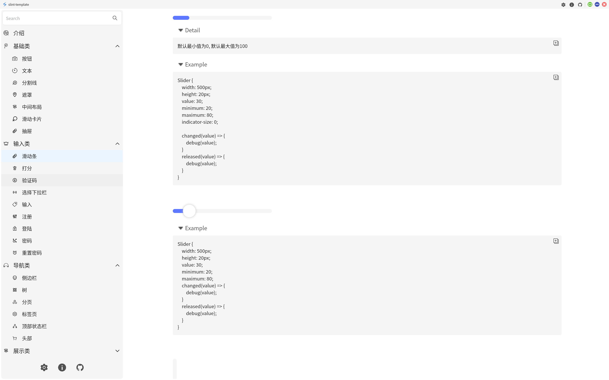

<div style="display: flex, margin: 8px">
    
    
    
    
    
    
    
</div>

[English Documentation](./README.md)

### 简介
这是一个基于Rust和Slint GUI框架的模板项目。包含一些常用的组件，设置面板，配置文件，简单的数据库功能和其他小功能。这个项目的主要目的是给新手开发者提供一个简单快速的Slint GUI开发环境。该项目能够编译到桌面平台（Windows, Linux, Macos），Android移动平台和Web平台。

### 安卓平台编译信息
- `min-sdk-version = 23`
- `target-sdk-version = 32`

### 如何构建?
- 安装 `Rust` 和 `Cargo`
- 安装 Android `sdk`, `ndk`, `jdk17`, 和设置对应的环境变量
- 例子:
```
    export JAVA_HOME=$LIBRARY_PATH/openjdk
    export ANDROID_HOME=$HOME/Android/Sdk
    export ANDROID_NDK=$HOME/Android/Sdk/ndk/27.0.12077973
    export ANDROID_NDK_ROOT=$HOME/Android/Sdk/ndk/27.0.12077973
```

- 运行 `make android-build-release` 编译安卓平台程序
- 运行 `make desktop-debug` 调试桌面平台程序
- 运行 `make desktop-build-release` 编译桌面平台程序
- 运行 `make web-build-dist` 编译Web平台。构建输出目录`web/dist`
- 参考 [Makefile](./Makefile) 了解更多信息

### 参考
- [Slint Language Documentation](https://slint-ui.com/releases/1.0.0/docs/slint/)
- [slint::android](https://snapshots.slint.dev/master/docs/rust/slint/android/#building-and-deploying)
- [Running In A Browser Using WebAssembly](https://releases.slint.dev/1.7.0/docs/slint/src/quickstart/running_in_a_browser)
- [github/slint-ui](https://github.com/slint-ui/slint)
- [Viewer for Slint](https://github.com/slint-ui/slint/tree/master/tools/viewer)
- [LSP (Language Server Protocol) Server for Slint](https://github.com/slint-ui/slint/tree/master/tools/lsp)
- [developer.android.com](https://developer.android.com/guide)
- [color4bg](https://www.color4bg.com/zh-hans/)
- [How to Deploy Rust Binaries with GitHub Actions](https://dzfrias.dev/blog/deploy-rust-cross-platform-github-actions/)
